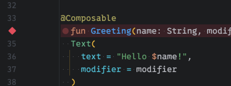

# Androidデバッグ
## はじめに
Androidアプリ開発に限らず、プログラム開発において問題特定と解決は非常に大きな要素です。
Android Studioには多くのデバッグ機能が搭載されており、アプリ開発に大いに役立ちます。
本ドキュメントでは、実務の開発現場でよく利用されるデバッグ技術を学びながら、デバッグ力を身につけることを目的としています。

## 扱う内容
1. Android Studioのデバッグ機能
2. Logcat
3. ログ出力
4. HTTPリクエストのログ確認
5. BreakPoint
6. Layout Inspector (Compose)
7. よくあるエラーとその解決方法
8. デバッグのベストプラクティス

## Android Studioのデバッグ機能
Android Studioは、Androidアプリ開発のための統合開発環境（IDE）であり、強力なデバッグツール群を提供しています。これらのツールを活用することで、コードの実行をステップごとに追跡したり、変数の値を確認したり、実行時のエラーを特定したりすることが容易になります。代表的な機能には、Logcat、ブレークポイント、Layout Inspectorなどがあります。これらの機能を使いこなすことで、開発効率を大幅に向上させることができます。

### デバッグモード
通常の実行（Run）ではなく、デバッグモードでアプリを実行することで、アプリの挙動をより詳細に調べながらデバッグができます。

1. Android Studioのツールバーにある「Debug」ボタン（虫のアイコン）をクリックする
2. または、`Run > Debug 'app'`を選択する

デバッグモードでは、ブレークポイントでの停止、変数の監視、ステップ実行などの機能が利用可能になります。

## Logcat
Logcatは、Androidシステムや実行中のアプリから出力されるログメッセージを表示するウィンドウです。アプリの動作状況、エラーメッセージ、警告、開発者が出力したカスタムログなどをリアルタイムで確認できます。

### Logcatの表示方法
1. Android Studioの下部にある「Logcat」アイコン（猫のアイコン）をクリックする
2. または、`View > Tool Windows > Logcat`メニューを選択する

### Logcatの効果的な使い方
- **フィルタリング**: 上部の検索ボックスを使用して、特定のタグやメッセージ、正規表現でフィルタリング
- **ログレベルの選択**: Verbose、Debug、Info、Warn、Error、Assertの各レベルでフィルタリング
- **プロセスの選択**: 複数のアプリが実行されている場合、特定のアプリのログのみを表示
- **フィルタリングせずに検索**: ログを表示しながら特定のログを検索可能

### 実践的なフィルタリング例
- アプリのパッケージ名: `package:com.dmm.bootcamp.yatter2025`
  - Android Studioで今開いているアプリのみ: `package:mine `
- 特定のタグ: `tag:Yatter`
- エラーのみ: `level:error`
- 特定の例外のみ: `java.lang.NullPointerException`

## ログ出力
開発中に特定の変数の値や処理の通過点を確認したい場合、`Log`クラスを使用してLogcatにメッセージを出力することができます。Kotlinでの基本的な使い方は以下の通りです。

```kotlin
import android.util.Log

// ...

// 例: デバッグログを出力
Log.d("Yatter", "Current value of counter: $counter")

// 例: 情報ログを出力
Log.i("Yatter", "User successfully logged in.")

// 例: エラーログを出力
Log.e("Yatter", "Error occurred during data fetch", exception)
```

### ログレベルの使い分け
`Log`クラスには複数のログレベルに対応するメソッドがあります。

- `Log.v()` (Verbose): 最も詳細なログ。開発中の詳細なトレースに使用
- `Log.d()` (Debug): デバッグ時に有用な情報。開発中に一時的に使用し、リリース時には削除または無効化することが多い
- `Log.i()` (Info): アプリの通常の動作を示す情報。重要な処理の開始/終了など
- `Log.w()` (Warn): 予期しない問題や、将来問題になる可能性のある状況を示す警告
- `Log.e()` (Error): 実行中に発生したエラー。クラッシュには至らないが、機能が正しく動作しない場合など
- `Log.wtf()` (What a Terrible Failure / Assert): 発生してはならない致命的なエラー

第一引数にはログを識別するためのタグ（クラス名や機能名、定数などで定義すると管理しやすい）、第二引数に出力したいメッセージを指定します。これにより、Logcatで特定のタグやログレベルでフィルタリングして、関連するログだけを効率的に追跡できます。開発段階では `Log.d` を多用し、重要な処理の流れには `Log.i` を使うなど、目的に応じて使い分けることが推奨されます。

### 効果的なログ出力のコツ
- **一貫したタグの使用**: クラスや機能ごとに一貫したタグを使用すると、関連するログを見つけやすくなる
- **意味のあるメッセージ**: 「エラー発生」ではなく「ユーザーデータ取得中にネットワークエラー発生」のように具体的に記述する
- **変数値の出力**: デバッグに必要な変数値を含める（例：`"User ID: $userId, Status: $status"`）
- **処理の開始/終了**: 複雑な処理の開始と終了をログに記録すると、処理の流れを追いやすくなる

```kotlin
fun complexOperation(data: String) {
    Log.d(TAG, "complexOperation: START with data=$data")
    
    // 処理内容
    
    Log.d(TAG, "complexOperation: END with result=$result")
}
```

### Timber - より便利なログライブラリ
実務では、標準の`Log`クラスの代わりに[Timber](https://github.com/JakeWharton/timber)ライブラリを使用することが多いです。Timberは以下の利点があります：

- タグの自動設定
- リリースビルドでのログ無効化が容易

```kotlin
// 初期化（Application クラスで）
Timber.plant(Timber.DebugTree())

// 使用例
Timber.d("Current value: %s", value)
Timber.e(exception, "Error occurred")
```

## HTTPリクエストのログ確認
ネットワーク通信を行うアプリでは、HTTPリクエストとレスポンスの内容を確認することがデバッグにおいて重要になります。特にAndroid開発では、ネットワークライブラリとしてRetrofitとOkHttpの組み合わせが広く使われています。
多くのプロジェクトでは、開発ビルド時にOkHttpの `HttpLoggingInterceptor` が設定されており、通信内容が自動的にLogcatに出力されるようになっている場合があります。

### HttpLoggingInterceptorの設定
`HttpLoggingInterceptor` を利用することで、リクエスト/レスポンスのヘッダ、ボディ、ステータスコードなどの詳細な情報をLogcatに出力できます。

```kotlin
import okhttp3.OkHttpClient
import okhttp3.logging.HttpLoggingInterceptor

// ...

// ログレベルを設定 (BODYならヘッダとボディ両方、HEADERSならヘッダのみ等)
val logging = HttpLoggingInterceptor().apply {
    level = HttpLoggingInterceptor.Level.BODY
}

val client = OkHttpClient.Builder()
    .addInterceptor(logging) // インターセプターを追加
    .build()

// RetrofitなどでこのOkHttpClientインスタンスを使用する
```

### ログレベルの種類
- `NONE`: ログを出力しない
- `BASIC`: リクエスト/レスポンスの基本情報のみ
- `HEADERS`: ヘッダー情報を含む
- `BODY`: ヘッダーとボディ両方の情報

### Logcatでの確認方法
`HttpLoggingInterceptor` が出力するログには、通常 `OkHttp` というタグが付与されます。Logcatウィンドウ上部のフィルター入力欄に `OkHttp` と入力するか、あるいはリクエスト先のURLの一部や特定のキーワード（例: `--> GET`, `<-- 200 OK`）でフィルタリングすることで、通信ログを簡単に見つけることができます。

出力レベルが `BODY` に設定されている場合、リクエストとレスポンスの内容がそのまま表示されるため、APIとの送受信データが正しいか、エラーレスポンスの内容は何かなどを直接確認でき、問題解決に役立ちます。

### 実際のログ出力例
```
D/OkHttp: --> POST https://api.example.com/login
D/OkHttp: Content-Type: application/json; charset=UTF-8
D/OkHttp: Content-Length: 53
D/OkHttp: 
D/OkHttp: {"username":"user123","password":"0123456789"}
D/OkHttp: --> END POST (53-byte body)
D/OkHttp: <-- 200 OK https://api.example.com/login (352ms)
D/OkHttp: Content-Type: application/json
D/OkHttp: 
D/OkHttp: {"token":"eyJhbGciOiJIUzI1NiIsInR5cCI6IkpXVCJ9...","user_id":12345}
D/OkHttp: <-- END HTTP (157-byte body)
```

### セキュリティ上の注意点
ただし、本番環境（リリースビルド）ではログレベルを `NONE` にするかインターセプター自体を除外するなどして、機密情報（トークンや個人情報など）がログに出力されないように構成することが非常に重要です。

```kotlin
// ビルドタイプに応じてログレベルを変更する例
val loggingLevel = if (BuildConfig.DEBUG) {
    HttpLoggingInterceptor.Level.BODY
} else {
    HttpLoggingInterceptor.Level.NONE
}
```

## BreakPoint
ブレークポイントは、コードの特定の行でプログラムの実行を一時停止させるためのマーカーのようなものです。デバッグモード（Run > Debug 'app'）でアプリを実行すると、処理実行がブレークポイントに到達した時点で一時停止します。

一時停止すると、その時点の変数や式を検証したり1行ずつ実行したりすることで問題がどのような原因で発生しているかを調査することができます。

### ブレークポイントの設定方法
Android Studioでは、一時停止したいコードの行番号をクリックするだけで簡単にブレークポイントを設定・解除できます。
一部のブレークポイントは行番号クリックでは設定できませんが、基本的には行番号をクリックして設定するものという認識で問題ないです。

設定したブレークポイントの一覧は、`Run > View Breakpoints` を選択することで確認できます。

### ブレークポイントの種類
- **行ブレークポイント**: 特定の行で停止する基本的なブレークポイント
- **メソッドブレークポイント**: 特定のメソッドの開始時や終了時に停止
- **フィールドブレークポイント**: 特定のフィールドやプロパティに対する読み書きが行われた時に停止
- **例外ブレークポイント**: 特定の例外が発生した時に停止
- **条件付きブレークポイント**: 特定の条件が満たされた時に停止

#### 行ブレークポイント
一時停止したいコードの行番号をクリックすることで設定可能です。
行ブレークポイントを設定できるとその行番号が赤い丸のアイコンが表示されます。


#### メソッドブレークポイント
メソッドの開始時や終了時に一時停止したいメソッド名が定義されているコードの行番号をクリックすることで設定可能です。
メソッドブレークポイントを設定できるとその行番号が赤いひし形のアイコンが表示されます。


また、メソッドブレークポイントはComposableメソッドにも適用できます。



#### フィールドブレークポイント
読み書きが行われた時に一時停止したいフィールドやプロパティが定義されているコードの行番号をクリックすることで設定可能です。
フィールドブレークポイントを設定できるとその行番号が赤い目のアイコンが表示されます。


#### 例外ブレークポイント
例外ブレークポイントは行番号クリックでは設定できません。  
ブレークポイント一覧を表示し、左上の「＋」ボタンを押し、「Java Exception Breakpoints」という項目を選択します。（kotlinコードであってもJava Exception Breakpointsです。）
一時停止したい例外のクラス名を入力することで、その例外が発生した時にアプリを一時停止することができます。

#### 条件付きブレークポイントの設定
条件付きブレークポイントも行番号クリックでは設定できません。
これまで紹介した方法で設定した各ブレークポイントを右クリックすることで、そのブレークポイントの条件等を設定できます。
右クリックした時に表示される「Condition」に`true`/`false`が返るような条件式を追加することで条件付きブレークポイントとなります。


### 停止時の値の確認方法
実行がブレークポイントで停止すると、Android Studioの下部に**Debugウィンドウ**が表示されます。
*   **Variables**: 現在のスコープにある変数とその値の一覧が表示されます。オブジェクトを展開して、そのプロパティやフィールドの詳細を確認することも可能です。
*   **Watches**: 特定の変数や式を常に監視できます。「+」ボタンをクリックして監視したい変数名や式を追加します。
*   **Frames**: コールスタック（メソッド呼び出しの階層）が表示されます。各フレームをクリックすると、そのメソッド呼び出し時点のコンテキストに切り替わります。

### ステップ実行
実行が停止した状態から、以下のボタンを使ってコードを一行ずつ進めることができます：

- **Step Over**: 現在の行を実行し、次の行に進む（メソッド呼び出しの中には入らない）
- **Step Into**: メソッド呼び出しの中に入る
- **Step Out**: 現在のメソッドから抜ける
- **Resume Program**: 次のブレークポイントまで実行を再開

### Evaluate Expression
実行が停止している状態で、任意の式を評価することができます：

1. `Alt+F8`キーを押すか、右クリックメニューから「Evaluate Expression」を選択
2. 評価したい式を入力（例: `user.getFullName()` や `list.size`）
3. 「Evaluate」ボタンをクリックして結果を確認

これにより、コードを変更せずに特定の式の結果を確認できます。

## Layout Inspector (Compose)
Layout Inspectorは、実行中のアプリのUI階層を視覚的に確認・分析するためのツールです。コンポーザブル関数がどのように組み合わされ、どのようなパラメータ（修飾子、値）で描画されているかをリアルタイムで確認できます。

### Layout Inspectorの起動方法
Shiftを2回押して「Toggle layout inspector」を選択して「ON」にすることで起動します。接続されているデバイスまたはエミュレータで実行中のアプリのプロセスを選択すると、Layout Inspectorウィンドウが開きます。

### Layout Inspectorの主な機能
- **Component Tree**: UI要素の階層構造を表示
- **Attributes**: 選択した要素のプロパティや修飾子を表示
- **3D View**: UI階層を3D表示して、重なりや階層関係を視覚的に確認
- **Live Updates**: リアルタイムでUIの変更を反映

### Composeでの活用方法
Jetpack Composeを使用している場合、Layout Inspectorは特に以下の点で役立ちます：

- コンポーザブル関数の階層構造の確認
- 各コンポーザブルに適用されているModifierの確認
- リコンポジションの発生状況の確認
- パフォーマンス問題の特定

### デバッグ時の活用例
- レイアウトの問題（余白、配置など）の原因特定
- 特定のUIコンポーネントに適用されているスタイルの確認
- 複雑なUI階層の分析
- 意図しないリコンポジションの検出

## よくあるエラーとその解決方法
Android開発では、いくつかの典型的なエラーパターンがあります。ここでは、初学者がよく遭遇するエラーとその解決方法を紹介します。

### NullPointerException
最も一般的な例外の一つで、nullオブジェクトのメソッドやプロパティにアクセスしようとした場合に発生します。Composeでも発生する可能性があります。

**エラーメッセージの例**:
```
java.lang.NullPointerException: Parameter specified as non-null is null: method kotlin.jvm.internal.Intrinsics.checkNotNullParameter
```

**解決方法**:
- Logcatでスタックトレースを確認し、どの行でエラーが発生しているかを特定
- 該当する変数が初期化されているか確認
- Kotlinの場合、Null安全演算子（`?.`）やElvis演算子（`?:`）を使用
- Composeの状態管理で、初期値が適切に設定されているか確認
- `remember { mutableStateOf(null) }` のような初期値がnullの状態を使用する場合は型を明示する（例: `remember { mutableStateOf<User?>(null) }`）

### IllegalStateException
Composeでは、コンポーネントが予期しない状態にある場合に発生することがあります。

**エラーメッセージの例**:
```
java.lang.IllegalStateException: Calling LaunchedEffect in composition without being installed in the composition
```

**解決方法**:
- Composeのライフサイクルを理解し、適切なタイミングで処理を行う
- `LaunchedEffect`や`DisposableEffect`などの副作用を正しく使用する
- 状態変更前に適切な条件チェックを追加
- コンポジションの外部で状態を変更しないようにする

### OutOfMemoryError
メモリ不足によりオブジェクトを割り当てられない場合に発生します。

**エラーメッセージの例**:
```
java.lang.OutOfMemoryError: Failed to allocate a 4194304 byte allocation with 1048576 free bytes
```

**解決方法**:
- 大きな画像の読み込み方法を最適化（サイズダウン、キャッシュの利用など）
- メモリリークを特定して修正（Android Profilerを使用）
- 不要なオブジェクトを適切に解放

### ANR (Application Not Responding)
メインスレッドがブロックされ、UIが応答しなくなった場合に発生します。

**症状**:
- アプリが一時的にフリーズ
- 「アプリが応答していません」というダイアログが表示される

**解決方法**:
- 重い処理はバックグラウンドスレッドで実行（Coroutines、RxJava、Threadなど）
- メインスレッドでのネットワーク通信やディスクI/Oを避ける
- ANRの原因を特定するためにLogcatとProfilerを使用

## デバッグのベストプラクティス
効率的なデバッグのために、以下のベストプラクティスを心がけましょう。

### 1. 体系的なアプローチ
- 問題を再現できる最小限のケースを特定する
- 仮説を立て、検証するというサイクルを繰り返す
- 一度に一つの変更を行い、その効果を確認する

### 2. ログの活用
- 重要なポイントにログを配置する
- 開発中は詳細なログを出力し、本番環境ではログ出力しすぎないようにする
- エラー発生時には関連する変数の値も一緒にログ出力する

### 3. バージョン管理の活用
- デバッグ中の変更は小さく分けてコミットする
- 問題が解決したら、不要なデバッグコードを削除してからコミットする
- 複雑な問題の場合、デバッグ専用のブランチを作成する

### 4. チームでのデバッグ
- 行き詰まったら、他のメンバーに相談する（ラバーダック・デバッグ）
- 問題と解決策を文書化して共有する
- 同様の問題が再発しないよう、テストを追加する

### 5. デバッグツールの組み合わせ
- 単一のツールに頼らず、複数のツールを状況に応じて使い分ける
- 例えば、Logcatでエラーを特定し、ブレークポイントで詳細を調査し、Profilerでパフォーマンス問題を確認するなど

## その他の便利なデバッグツール

### Android Profiler
メモリ使用量、CPU使用率、ネットワークアクティビティなどを監視するためのツールです。

1. Android Studioのメニューから `View > Tool Windows > Profiler` を選択
2. または、下部の「Profiler」タブをクリック

主な機能：
- **CPU Profiler**: CPU使用率とメソッド実行時間の分析
- **Memory Profiler**: メモリ使用量とメモリリークの検出
- **Network Profiler**: ネットワークリクエストの監視
- **Energy Profiler**: バッテリー消費の分析

### Database Inspector
Room、SQLiteなどのデータベースの内容をリアルタイムで確認・編集できるツールです。

1. Android Studioのメニューから `View > Tool Windows > App Inspection` を選択
2. 「Database Inspector」タブを選択

主な機能：
- データベースの内容の閲覧
- SQLクエリの実行
- テーブル構造の確認
- データの編集

### Wireless Debugging
Android 11以降では、USBケーブルなしでデバッグが可能になりました。

設定方法：
1. デバイスの開発者オプションで「ワイヤレスデバッグ」を有効化
2. Android Studioの「Device Manager」から「Pair using Wi-Fi」を選択
3. デバイスに表示されるペアリングコードを入力

## まとめ
Androidアプリ開発におけるデバッグは、様々なツールと技術を組み合わせて行います。本ドキュメントで紹介した内容を活用することで、効率的に問題を特定し解決できるようになるでしょう。

デバッグは単なる問題解決だけでなく、コードの動作を深く理解するための学習プロセスでもあります。デバッグを通じて得た知識は、より堅牢なコードを書くための貴重な財産となります。

最後に、デバッグは忍耐と論理的思考が求められる作業です。一度にすべてのテクニックを習得する必要はなく、アプリ開発しながら少しずつスキルを磨いていきましょう。
