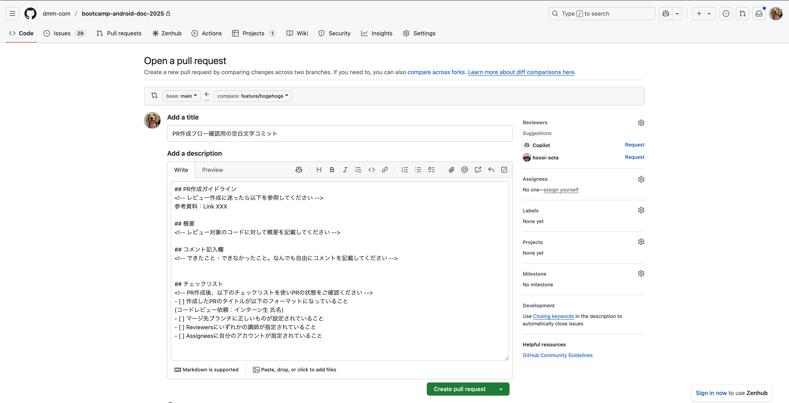
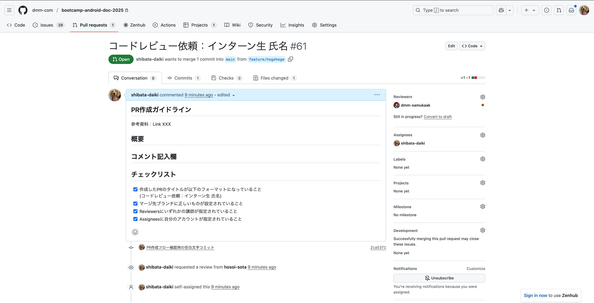

# [前の資料](./1_セットアップ.md)
# ブランチ運用 

本章ではインターン中に行うブランチ運用について説明します。
ここではターミナル上での操作で説明しますが、[GUIツール]を利用した場合でも同様です。

## mainブランチとfeatureブランチ

Git ブランチを管理する手法は様々ありますが、今回のインターンでは[Github フロー]を利用します。

このフローではmainブランチとfeatureブランチの2種類を利用します。

それぞれのブランチは以下の役割を持っています。

### main
文字通りメインで使用するブランチです。
このブランチは常に最新の状態を保っており、安定している必要があります。
リリース等がある場合はここからリリースビルドなどが作成されたりします。

### feature
作業するためのブランチです。
mainブランチのソースコードに対して、追加開発やバグ修正などソースコードを書き換えることになった際にはmainブランチからfeatureブランチを切り、featureブランチ上でソースコードの改修を行います。
ソースコードの改修が終わった時にはPull Request等でfeatureブランチをmainブランチにマージします。

図で表すと下記のようになります。


次にターミナルやGithub上の操作を交えて実際の作業の流れについて説明します。


## 作業の流れ

### 1. 作業開始時

作業開始時にはmainブランチからfeatureブランチを切って作業をします。

まずpullをしてローカルのmainブランチを最新にしておきましょう

```sh
$ git pull
Already up to date.
```

`Already up to date.` と表示されていれば大丈夫です。

次に作業ブランチを切りましょう。
ブランチ名は`feature/hogehoge`(hogehogeは作業の名前をあらわす単語等)とすることが多いです。

`git switch -c ブランチ名` でブランチを作成し、作成したブランチに移動することがことができます。


```sh
$ git switch -c feature/hogehoge
```

`switch`はブランチを切り替えるコマンドで、`-c`は新規でブランチを作成するオプションです。
単にブランチを切り替える場合は`switch`のみでOKです。
例えばmainブランチに切り替えたい場合は以下のようになります。

```sh
$ git switch main
```

現在どのブランチがわからない場合は `git branch --show-current` と打つと現在のブランチを確認できます。

```sh
$ git branch --show-current
feature/hogehoge
```

これでブランチの準備はできたので、作業やコミットをして改修を進めます。

### 2. 作業完了時

作業が完了したらmainブランチにfeatureブランチで行った作業内容を取り込みましょう。
mainブランチに向けてPull Requestを作る方法を説明します。

まずfeatureブランチででコミット忘れがないか確認しましょう。

`git status`で確認できます。

```sh
$ git status
On branch feature/hogehoge
Changes to be committed:
  (use "git restore --staged <file>..." to unstage)
	modified:   "hogefugafuga.kt"
Changes not staged for commit:
  (use "git add <file>..." to update what will be committed)
  (use "git restore <file>..." to discard changes in working directory)
	modified:   "fugafuga.kt"

Untracked files:
  (use "git add <file>..." to include in what will be committed)
	"hogefuga.kt"
```

上記のように`to be committed`や`Untracked files` の部分に今回の改修に入れたいものがある場合はコミットしておきましょう。

以下のようになっている場合はコミット忘れはありません。

```sh
$ git status
On branch feature/hogehoge
nothing to commit, working tree clean
```


次に作業していたブランチをpushしてみましょう`git push origin ブランチ名` で行えます。


```
$ git push --set-upstream origin feature/hogehoge
Enumerating objects: 25, done.
Counting objects: 100% (24/24), done.
Delta compression using up to 11 threads
Compressing objects: 100% (11/11), done.
Writing objects: 100% (13/13), 1.80 KiB | 1.80 MiB/s, done.
Total 13 (delta 8), reused 4 (delta 2), pack-reused 0
remote: Resolving deltas: 100% (8/8), completed with 4 local objects.
remote: 
remote: Create a pull request for 'feature/add-git-flow-doc' on GitHub by visiting:
remote:      https://github.com/usename/repositoryname/pull/new/feature/hogehoge
remote: 
To github.com:username/repositoryname.git
 * [new branch]      feature/hogehoge -> feature/hogehoge
branch 'feature/hogehoge' set up to track 'origin/feature/hogehoge'.
```

`* [new branch]` のところにpushしたブランチ名があればOKです。

次にPull Requestを作成しましょう。

GitHubのリポジトリのページへいくと、ブランチをPushした直後では下記のようにPushしたブランチ名と`Compare & pull request` というボタンが表示されています。このボタンをクリックすると、Pull Request作成画面が表示されます。
もし`Compare & pull request` ボタンが表示されていない場合、 `New pull request`ボタンをクリックすることでもPull Request作成画面が表示されます。


ボタンをクリックすると、下記のようなPull Requetの作成画面が表示されます。Descriptionには事前に設定したPRテンプレートの内容が入力されています。



表示されたPull Request作成画面で、意図したブランチが設定されているか確認しましょう。base:がマージ先、compare:がマージしたいブランチとなります。`base:main`となっていること、`compare:feature/hogehoge`となっていることを確認できればOKです。

Pull Requestのタイトルや説明を入力後、下部にある`Create pull request` ボタンをクリックするとPull Requestの作成は完了です。



Pull Requestを作成した後でも修正は可能です。修正したい対象に応じて、以下を参考に更新してください。
| 修正対象 | 修正方法 |
| ---- | ---- |
| Title | 画面右上の`Edit`ボタンをクリック<br>入力後`Save`ボタンをクリックして更新完了 |
| Description | 3点リーダをクリック後、表示されるEditをクリック<br>入力後`Update Comment`ボタンをクリックして更新完了 |
| Reviewers |Reviewers横の歯車アイコンをクリック<br>対象をクリック後、リスト外をクリックして更新完了|
| Assignees |Assignees横の歯車アイコンをクリック<br>対象をクリック後、リスト外をクリックして更新完了|


### 3. mainブランチへの取り込み

Pull Request上でソースコードの差分をチェックし、問題なければマージしましょう。
チームで作業をするときは、ここでPullRequestのレビューが入ることが多いです。
レビューしてくれた人からapproveをもらえたらマージしましょう。

開発作業があるたびにこの流れを反復します。

# [次の章へ](./3_エミュレータ作成.md)


[Github フロー]: https://docs.github.com/ja/get-started/using-github/github-flow
[GUIツール]: https://git-scm.com/downloads/guis
