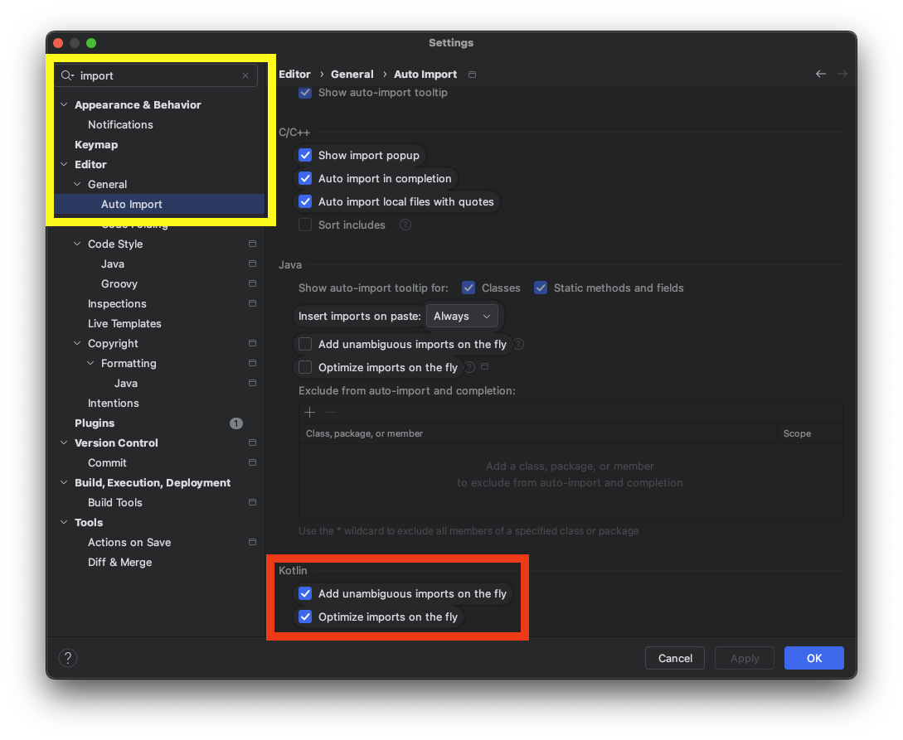
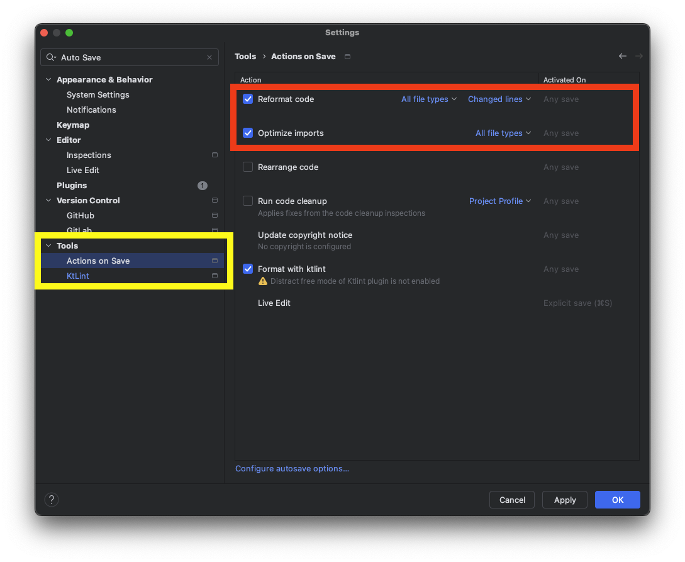
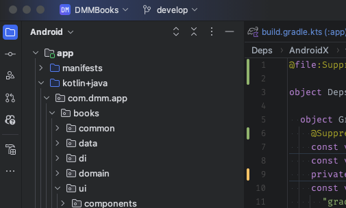
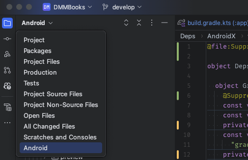
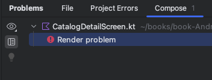
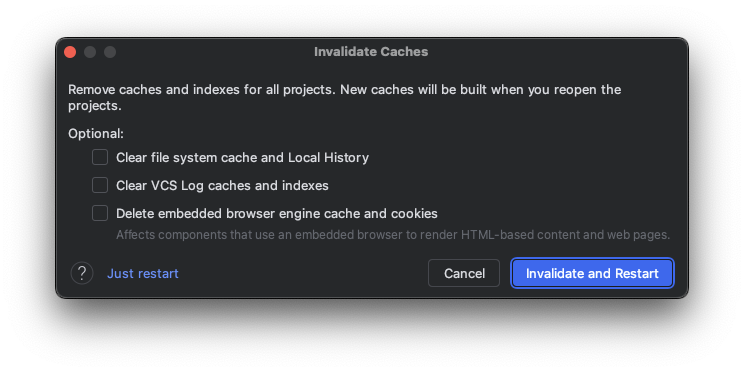

<!-- FIXME: 正しいリンクに修正 -->
# [前の章へ(UI実装に必要な知識)](../UI実装に必要な知識/1_概要.md)

# Android StudioのTips
Yatterの実装に入る前に、Android Studioの便利な使い方を知りましょう。
少し使い方を覚えるだけで、開発効率がよくなります。

## ショートカット編
覚えると便利なもの順で記載しています。
| ショートカット | できる事                                                        | 備考                           |
| -------------- | --------------------------------------------------------------- | ------------------------------ |
| ⇧⇧             | 全体検索 (Android Studioの機能、コード、リソース、etc)          | Shiftキーを2回押す             |
| ⌘ + B          | 定義元か使用箇所にジャンプ                                      |                                |
| ⌥ + Enter      | クイックアクションを実行 (importや警告への自動対応など)         |                                |
| ⌘ + ⇧ + F      | 全文検索                                                        |                                |
| ⌘ + ⇧ + O      | ファイル名で検索                                                |                                |
| ⌘ + [ か ⌘ + ] | カーソルの履歴を戻る / 進む                                   | 定義ジャンプをした際などに便利 |
| ⌘ + O          | Class名で検索                                                   |                                |
| ⌥ + ⌘ + O      | 特定のシンボルを検索                                            |                                |
| ^ + R          | ビルド                                                          |                                |
| ⌥ + ⌘ + ⇧ + R  | Build & Refresh (Previewが更新されない場合にリセットしてくれる) |                                |

その他キーマップの一覧は公式サイトにあります！  
https://developer.android.com/studio/intro/keyboard-shortcuts

映像付きで、ショートカットの解説をしている動画もあります！  
古い動画なのでみなさんの使っている画面とは見た目が乳部異なりますが、ショートカット自体は変化していないため参考になるはずです。  
https://www.youtube.com/watch?v=qoWmJ8tPY_I (気になったら見るぐらいでOKです。30分ほどあります。)

## 設定編
Android Studioのデフォルト設定は少しいけてない設定があるので、まずはそこを修正しましょう。  
設定 > Editor > General > Auto Import を開き (設定を開いて、importで検索すると楽です。)  
Kotlinのタブにある二つの設定を有効にします。

次に、保存時に自動的にImportの整理とコード整形できる設定を有効にします。  
設定 > Tools > Actions on Save を開き、`Reformat code`と`Optimize imports`を写真と同じように設定します。

これらの設定によって、手動でのインポート整理とコード整形が不要になりました。

## プラグイン編
プラグインは好みが大きいと思うので最低限の紹介です。
もっと色んなプラグインを知りたい方は、講師陣へぜひ質問してください！
| 名前 | できる事 |
| - | - |
| Inspaction lends | ErrorやWarningなどをエディタ上の該当行の末尾に表示してくれます。 プラグインを入れない場合でも、サイドバーの左下にある`Problems`から確認できます。|
| Github Copilot | **Android Studio備え付けのGeminiが使用禁止**であるため、代わりにGithub Copilotを使用します。 Github Copilotの使用には申請が必要なため、必要な方は各自で申請をお願いします。 申請から実際に使えるようになるまではラグがあるため、早めの申請をおすすめします。|

## その他
困った時や、よりおすすめな設定を紹介しています。  
読み飛ばしても構いません。

### 左サイドバーの設定
Android Studioでアプリ開発をしているとき、多くの場合は左サイドバーで`Project`を開いています (VSCodeでのエクスプローラー)。
`Project`タブは、デフォルトで`Android`という表示になっています。

`Android`の表示は実際のディレクトリ構造とは異なり、パッケージに従って並んでいるため、わかりづらい場合があります。
実際のディレクトリ構造と同じ配置に変更する場合は、`Android`と書かれている部分をクリックし、`Project`を選択してください。

### 何をやってもプレビューが出てこない時
Androidアプリを開発していると、UIのプレビューがいつまで経っても更新されなかったり、表示されなかったりします。
そんな時は、次の手順で確認して見てください。
1. どこかでビルドエラーが起きているか確認
    1. プレビューの右上にあるを押して、Build & Refresh を実行する
        *  `⌘ + ⌥ + ⇧ + R`でも実行できます
    2. Problems欄にRenderingエラーがないか確認
        * `⌘ + 6`で表示できます
    4. エラーがあった場合、解消する 
2. キャッシュをクリアする
   1. File > Invalidate Cache をクリックする。 
   2. Invalidate and Restart をクリックする。 